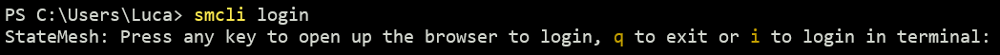
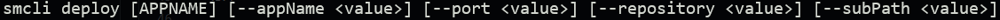
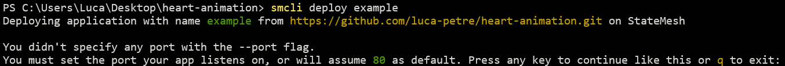
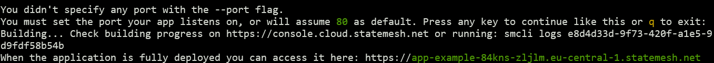
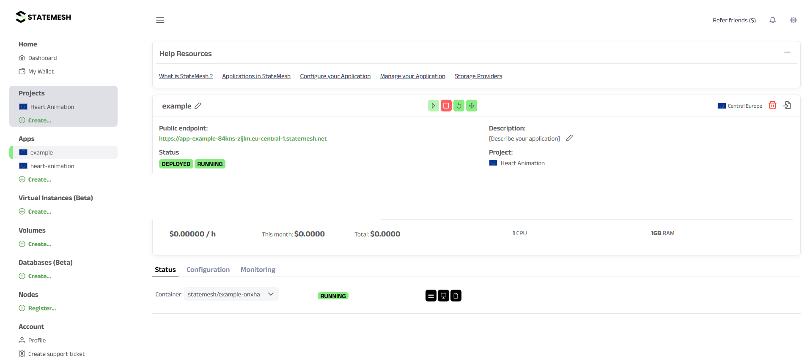
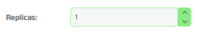
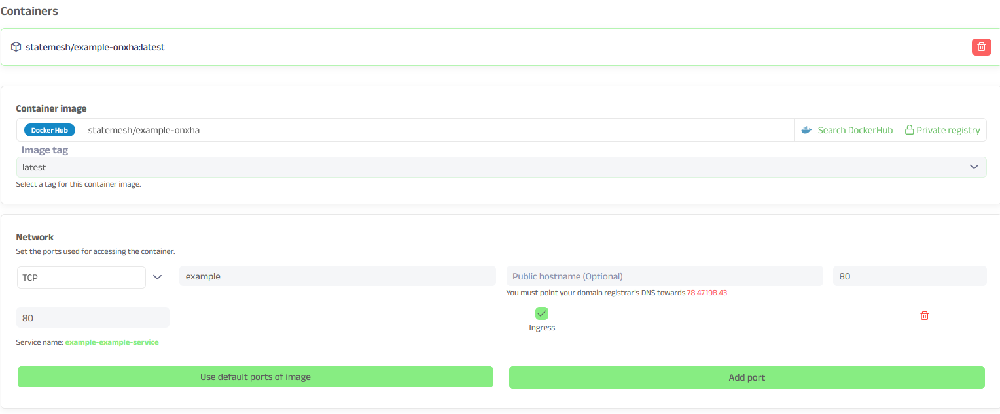
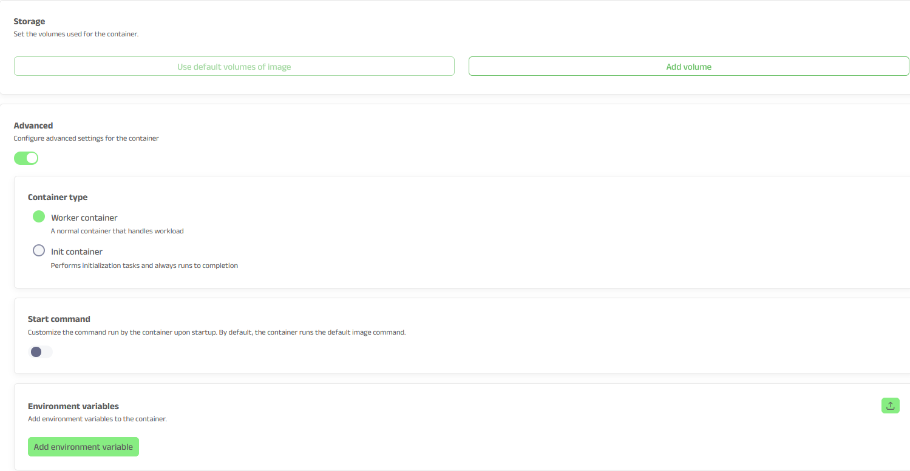
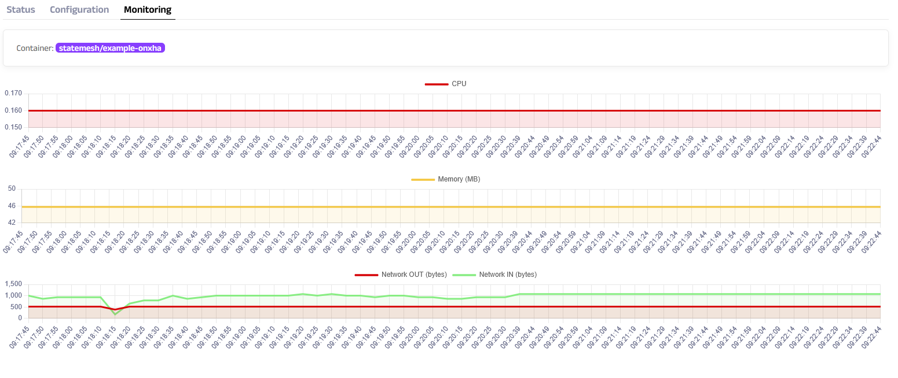

# Deploying my first app with StateMesh

**StateMesh** is the first decentralized cloud architecture in the world, replacing conventional data centers with a worldwide network of crowdsourced node operators while preserving AWS/GCP/Azure-like functionality, security, and resilience. Compared to current decentralized computing implementations, its permissionless nature, fair participation mechanism, and decentralized architecture provide notable improvements.

## 1. Project idea
I decided to deploy a single-page web app built using HTML, CSS, and JavaScript. The application renders a heart-shaped particle animation on an HTML5 canvas, creating a visual effect where particles flow to form and maintain the shape of a heart. The purpose of the project was primarily to explore front-end animation techniques and to practice deploying a web application.

## 2. Prerequisites
In order to deploy my app on **StateMesh**, I registered on the platform and followed a tutorial in order to understand how the `StateMesh console` works. After deploying a template-based app, I installed the `StateMesh CLI`, a terminal-based interface for managing deployments. It allows developers to initialize projects, configure settings, and deploy applications directly from the command line.

## 3. Deployment on StateMesh
To make the application publicly accessible, I deployed it using **StateMesh**. The deployment process involved preparing the project files (`index.html`, `heart.js`, `heart.css`) and adjusting the server so that it displayed my `index.html` file. I relied heavily on the `StateMesh CLI`, which made it straightforward to package and publish my application. I was able to push my project files to **StateMesh**, where they were automatically built and hosted. The CLI then provided me with a public endpoint that I could use to access the deployed application in the browser. Throughout the process, I mainly interacted with the platform through terminal commands, which offered a fast and efficient way to manage deployment without needing a separate dashboard.

## 4. How I deployed my first app on StateMesh
After creating my **StateMesh** account, I have used the terminal in order to log in. By running the command `smcli login`, you will be greeted by the option of logging in inside the termianl or they will take you to their log in page on browser. 



Next up, I went into the directory that my repository was cloned and saved. Once I reached the directory I wanted to deploy, I used the command `smcli deploy`, in order to start the deployment process. But that's not all. You need to specify some other things, such as the app name, the port (80 by default), a repository and a subpath. So the deployment command might look something like this:


```bash
NOTE: If you are already inside the repository you want to deploy, you do not need to mention the repository and subpath. 
You only need to mention the port if you do not want it to be default (80).
```
As mentioned before, I already went inside the directory I wanted to deploy, so this made my job easier. After writing the command and gave my app a name, I was asked about the port. 



After you choose the port (I decided to go default), your app will start the building proccess. In the terminal you can't see much. You get a link to the `StateMesh console` and one more link to the external endpoint, which in my case was my `index.html` file.



After following the link to the `StateMesh console`, you will land on your app. If you press the green link, you will get redireccted t the publicc endpoint, in my case I will get redirected to see my `index.html` file. 



**StateMesh** makes it super easy to configure and manage your app in their console. For example if you want to change the number of replicas, it is just one click away, under the configuration tab. 



If you want to manage your container you can do that too. You can change the image tag, your port, the internet protocol from TCP to UDP, the service name, you can add a start command, you can even add containers. Name it and **StateMesh** has it. 



Lastly, the `StateMesh console` brings out the monitoring feature, where you can see how much the container you are running is consuming. **StateMesh** is known for the lower cost in exchange for the better value. But where **StateMesh** excells is the position it occupies as being more resource-efficient than many traditional could providers.



## 5. Conclusion
Working with **StateMesh** gave me a practical understanding of how simple it can be to deploy a static web application. By using the `StateMesh CLI`, I was able to upload my project files, configure the deployment, and obtain a public endpoint with minimal effort. The platform handled the server setup in the background, which allowed me to focus entirely on the application itself rather than infrastructure details.

Overall, the process helped me expose my project with a public endpoint without needing to manually configure servers or networking, highlighting how `StateMesh` simplifies deployment. 

## [StateMesh Documentation](https://docs.statemesh.net/)